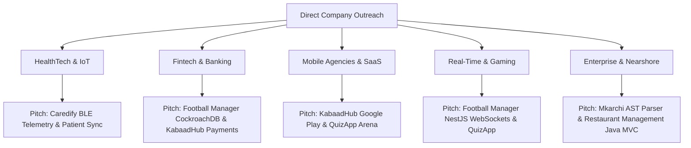

# 🇹🇳 Tunisia Tech Company & Recruiter Prospecting Database (`tunisia-tech-targets.md`)

*Research Date: September 2026*  
*Candidate Profile: Soufyan Rachdi · Computer Science Graduate (ISIMG) · Full-Stack, Mobile (Flutter), Node.js/NestJS, Real-Time WebSockets & BLE Telemetry*  
*Candidate Portfolio: [https://soufyanrachdi.vercel.app/](https://soufyanrachdi.vercel.app/) · GitHub: [https://github.com/SoufyanRachdi](https://github.com/SoufyanRachdi)*

---

## 1. Company Prioritization & Scoring Algorithm (0–100)

Every company is evaluated against a 100-point rubric tailored to your authentic technical stack and graduate profile:

| Evaluation Dimension | Max Points | Criteria & Justification |
| :--- | :---: | :--- |
| **1. Technical Stack Match** | **25 pts** | Direct alignment with **Flutter/Dart**, **Node.js/NestJS**, **React/Next.js**, **WebSockets**, **BLE/IoT**, **Prisma/Redis**, **Java/Kotlin/Android**. |
| **2. Hiring Potential & Growth** | **20 pts** | Engineering team scale, active developer recruiting history, business expansion. |
| **3. Junior / Graduate Accessibility** | **15 pts** | History of hiring ISIMG/Tunisian university graduates, internship-to-hire paths, entry-level engineering openness. |
| **4. Company Quality & Product Depth** | **10 pts** | Proprietary SaaS products, modern engineering culture, low turnover. |
| **5. International / Nearshore Scope** | **10 pts** | Work with European (France, Italy, Germany, UK) and North American clients or global markets. |
| **6. Remote / Hybrid Flexibility** | **10 pts** | Remote-first or flexible hybrid policies across Tunisian governorates (Tunis, Sousse, Sfax, Gabès). |
| **7. Direct Outreach Potential** | **10 pts** | High visibility of HR/Talent Acquisition, CTOs, Tech Leads, and Founders on LinkedIn. |
| **TOTAL SCORE** | **100 pts** | **Tier Classification**: 🔥 **90–100: Top Target** · 🟢 **80–89: High Priority** · 🟡 **70–79: Good Target** · 🟠 **60–69: Secondary** |

---

## 2. 🔥 TOP 20 TARGETS (Score 90–100) — Immediate Outreach Priority

These are the 20 highest-value companies to contact first. Each company has verified stack overlap, strong junior/nearshore potential, and direct project pitches.

### 1. Expensya
- **Score**: **98 / 100** | **Tier**: 🔥 TOP TARGET
- **City / Hub**: Tunis (Centre Urbain Nord / Lac 2) & Paris
- **Size**: 200–500 employees | **Industry**: Fintech / Enterprise B2B SaaS
- **Product**: Automated business spend management, expense reporting, and corporate card platforms.
- **Verified Stack**: React, Node.js, TypeScript, Mobile (Flutter/Native), Microservices, REST APIs, SQL.
- **Why Contact**: Market-leading Tunisian-founded fintech scaleup acquired by Medius. Large engineering hub in Tunis with continuous software engineering recruitment.
- **Target Roles**: Junior Full-Stack Developer, Junior Node.js Developer, Junior React Developer.
- **Best Project to Pitch**: **Football Manager** *(NestJS, Socket.IO, Prisma, distributed state)* & **QuizApp** *(Node.js, Supabase, real-time sync)*.
- **Key Contacts on LinkedIn**:
  - *Talent Acquisition / HR*: **Talent Acquisition Team / HR Manager @ Expensya** (Search: `"Talent Acquisition" "Expensya" Tunis`)
  - *Engineering Leadership*: **Engineering Managers / Lead Developers @ Expensya**
  - *Website / Careers*: [expensya.com/careers](https://www.expensya.com/fr/carrieres/) · [LinkedIn Company Page](https://www.linkedin.com/company/expensya/)

---

### 2. Kaoun / Flouci
- **Score**: **97 / 100** | **Tier**: 🔥 TOP TARGET
- **City / Hub**: Tunis (Berges du Lac 1)
- **Size**: 20–50 employees | **Industry**: Fintech Super-App / Neobanking
- **Product**: **Flouci** mobile application (instant bank account creation, digital wallet, merchant QR payments, bank API integration).
- **Verified Stack**: Flutter, Dart, React, Node.js, Express, WebSockets, PostgreSQL, Cloud Security.
- **Why Contact**: Top consumer fintech in Tunisia. Directly builds high-performance mobile apps in **Flutter** with secure real-time Node.js backends.
- **Target Roles**: Junior Flutter Developer, Junior Mobile Developer, Junior Node.js Developer.
- **Best Project to Pitch**: **KabaadHub** *(production commercial Flutter app published on Google Play)* & **Caredify** *(secure REST API + biometric streams)*.
- **Key Contacts on LinkedIn**:
  - *Co-Founder & CEO*: **Neffati Neffati** / **Anis Kallel** (Co-Founders @ Kaoun)
  - *CTO / Engineering Lead*: **Lead Mobile / Backend Engineer @ Kaoun / Flouci**
  - *Website / Careers*: [flouci.com](https://flouci.com/) · [LinkedIn Company Page](https://www.linkedin.com/company/kaoun/)

---

### 3. Wattnow
- **Score**: **96 / 100** | **Tier**: 🔥 TOP TARGET
- **City / Hub**: Tunis (Ariana / Ghazela Technopark)
- **Size**: 20–50 employees | **Industry**: IoT / Cleantech / Smart Energy Management
- **Product**: Smart hardware sensors communicating telemetry to an AI/ML energy optimization dashboard and mobile analytics apps.
- **Verified Stack**: IoT Telemetry, Python, Node.js, React, Mobile Apps, Bluetooth/MQTT/REST, Time-Series Databases.
- **Why Contact**: Perfect bridge for your hardware BLE telemetry and time-series data acquisition background. High-growth startup with European and African clients.
- **Target Roles**: Junior IoT / Full-Stack Developer, Junior Mobile Developer, Junior Python/Node Developer.
- **Best Project to Pitch**: **Caredify** *(wearable BLE sensor streaming, continuous waveform packets, time-series MongoDB storage)*.
- **Key Contacts on LinkedIn**:
  - *Founder & CEO*: **Issam Smaali** (CEO @ Wattnow)
  - *CTO / Hardware & Software Lead*: **Technical Lead / CTO @ Wattnow**
  - *Website / Careers*: [wattnow.io](https://wattnow.io/) · [LinkedIn Company Page](https://www.linkedin.com/company/wattnow/)

---

### 4. Proxym Group (Proxym-IT)
- **Score**: **96 / 100** | **Tier**: 🔥 TOP TARGET
- **City / Hub**: Sousse (Sahloul) & Tunis (Berges du Lac) & France
- **Size**: 200–500 employees | **Industry**: Digital Services / Mobile & Web Nearshore Hub
- **Product**: Enterprise mobile apps (m-banking, insurance, retail) and digital transformation platforms for European, Middle Eastern, and African clients.
- **Verified Stack**: Flutter, Dart, Android, Java, Kotlin, React, Node.js, Symfony, Cloud Services.
- **Why Contact**: One of Tunisia's premier mobile application development powerhouses. Dedicated mobile engineering teams with strong regional presence in both Sousse and Tunis.
- **Target Roles**: Junior Mobile Engineer (Flutter/Android), Junior Full-Stack Developer.
- **Best Project to Pitch**: **KabaadHub** *(commercial Flutter app on Play Store)* & **Football Manager** *(Flutter + NestJS/Socket.IO)*.
- **Key Contacts on LinkedIn**:
  - *HR & Talent Acquisition*: **Talent Acquisition Specialist / HR Manager @ Proxym Group**
  - *Co-Founder & CEO*: **Wassel Berrayana** (President / Founder @ Proxym Group)
  - *Technical Leads*: **Mobile / Web Tech Lead @ Proxym-IT**
  - *Website / Careers*: [proxym-group.com](https://www.proxym-group.com/) · [LinkedIn Company Page](https://www.linkedin.com/company/proxym-group/)

---

### 5. Cynoia
- **Score**: **95 / 100** | **Tier**: 🔥 TOP TARGET
- **City / Hub**: Tunis (Lac 1)
- **Size**: 10–30 employees | **Industry**: Enterprise SaaS / Collaboration & Communication
- **Product**: All-in-one B2B team collaboration workspace unifying chat, email, video meetings, and task project management into one portal.
- **Verified Stack**: React, Next.js, Node.js, WebSockets / Real-Time Messaging, TypeScript, Mobile (Flutter/React Native).
- **Why Contact**: Real-time collaboration platform requiring high-performance WebSocket messaging and full-stack synchronization.
- **Target Roles**: Junior Full-Stack Developer, Junior Node.js / React Developer, Junior Mobile Developer.
- **Best Project to Pitch**: **QuizApp Arena** *(Socket.IO sub-second synchronization & Supabase)* & **Football Manager** *(real-time state engine)*.
- **Key Contacts on LinkedIn**:
  - *Co-Founder & CEO*: **Nassim Letaief** / **Ayoub Rabeh** (Co-Founders @ Cynoia)
  - *Lead Engineer*: **Full-Stack / Technical Lead @ Cynoia**
  - *Website / Careers*: [cynoia.com](https://cynoia.com/) · [LinkedIn Company Page](https://www.linkedin.com/company/cynoia/)

---

### 6. Satoripop
- **Score**: **95 / 100** | **Tier**: 🔥 TOP TARGET
- **City / Hub**: Sousse (Kantaoui) & Tunis & Paris
- **Size**: 100–250 employees | **Industry**: Digital Agency / Custom Web & Mobile Solutions
- **Product**: Custom mobile applications, enterprise e-commerce, web applications, and AI digital experiences for European luxury, retail, and financial brands.
- **Verified Stack**: Flutter, React, Next.js, Node.js, Python, PHP/Symfony, Mobile UX/UI.
- **Why Contact**: Vibrant digital studio with strong engineering teams in Sousse and Tunis. Known for modern tech stacks, visual quality, and junior recruitment.
- **Target Roles**: Junior Mobile Developer (Flutter), Junior Full-Stack Developer.
- **Best Project to Pitch**: **KabaadHub** *(production mobile marketplace)* & **Mkarchi** *(Electron + Next.js developer workspace)*.
- **Key Contacts on LinkedIn**:
  - *Talent Acquisition / HR*: **HR Manager / Recruiter @ Satoripop**
  - *CEO / Founder*: **Karim Jouini** / **Leadership Team @ Satoripop**
  - *Technical Leads*: **Tech Lead Mobile / Web @ Satoripop**
  - *Website / Careers*: [satoripop.com](https://www.satoripop.com/) · [LinkedIn Company Page](https://www.linkedin.com/company/satoripop/)

---

### 7. Fabskill
- **Score**: **94 / 100** | **Tier**: 🔥 TOP TARGET
- **City / Hub**: Tunis (Centre Urbain Nord)
- **Size**: 20–50 employees | **Industry**: HRTech / Video AI Recruitment SaaS
- **Product**: Intelligent recruitment platform featuring automated video interviews, candidate tracking systems (ATS), and AI candidate ranking.
- **Verified Stack**: React, Next.js, Node.js, Python, TypeScript, REST APIs, WebSockets.
- **Why Contact**: Modern SaaS company building real-time video and candidate ranking workflows. Fast-paced startup environment open to driven junior developers.
- **Target Roles**: Junior Full-Stack Developer, Junior React / Node.js Developer.
- **Best Project to Pitch**: **QuizApp** *(interactive timers & cloud backend)* & **Mkarchi** *(Python AST parser & Next.js portal)*.
- **Key Contacts on LinkedIn**:
  - *Founder & CEO*: **Bechir Tourki** (CEO @ Fabskill)
  - *CTO / Head of Engineering*: **CTO / Technical Lead @ Fabskill**
  - *Website / Careers*: [fabskill.com](https://www.fabskill.com/) · [LinkedIn Company Page](https://www.linkedin.com/company/fabskill/)

---

### 8. Focus Corporation
- **Score**: **94 / 100** | **Tier**: 🔥 TOP TARGET
- **City / Hub**: Ariana (El Ghazela Technopark) & Tunis & Sousse
- **Size**: 500–1000 employees | **Industry**: Software Engineering & Embedded Systems
- **Product**: Large-scale software engineering services, embedded automotive systems, enterprise cloud, and mobile solutions for global tier-1 corporations (Nokia, Continental, SAP).
- **Verified Stack**: Java, Kotlin, C++, Python, Mobile (Android/iOS/Flutter), Cloud Services, Linux.
- **Why Contact**: One of the most prestigious software and systems engineering employers in Tunisia with structured junior onboarding and training academies.
- **Target Roles**: Junior Software Engineer, Junior Android / Mobile Developer, Junior Java Developer.
- **Best Project to Pitch**: **Anti-Scroll** *(native Android Accessibility Service in Java)* & **Restaurant Management** *(Java Swing MVC)* & **Caredify**.
- **Key Contacts on LinkedIn**:
  - *Talent Acquisition*: **Talent Acquisition Specialist / HR Team @ Focus Corporation**
  - *Engineering Directors*: **Software Engineering Managers @ Focus**
  - *Website / Careers*: [focus-corporation.com](https://www.focus-corporation.com/) · [LinkedIn Company Page](https://www.linkedin.com/company/focus-corporation/)

---

### 9. Wevioo
- **Score**: **94 / 100** | **Tier**: 🔥 TOP TARGET
- **City / Hub**: Tunis (El Ghazela Technopark) & Paris & Dubai
- **Size**: 300–600 employees | **Industry**: Nearshore Digital Services & IoT Engineering
- **Product**: Digital transformation, IoT connected device engineering, cloud consulting, and software development for European banking, logistics, and healthcare.
- **Verified Stack**: IoT / Embedded, Java, Node.js, React, Mobile (Flutter/Android), Cloud Services.
- **Why Contact**: Strong focus on IoT systems, connected hardware, and nearshore engineering. Excellent junior engineering environment.
- **Target Roles**: Junior Full-Stack Developer, Junior IoT / Mobile Engineer.
- **Best Project to Pitch**: **Caredify** *(BLE IoT streaming + Node.js/MongoDB)* & **KabaadHub**.
- **Key Contacts on LinkedIn**:
  - *Talent Acquisition*: **Recruitment & Talent Acquisition Specialists @ Wevioo**
  - *Head of HR*: **Human Resources Director @ Wevioo**
  - *Website / Careers*: [wevioo.com](https://www.wevioo.com/) · [LinkedIn Company Page](https://www.linkedin.com/company/wevioo/)

---

### 10. Dedagroup Tunisia
- **Score**: **93 / 100** | **Tier**: 🔥 TOP TARGET
- **City / Hub**: Tunis (Berges du Lac 1) & Italy (Trento/Milan)
- **Size**: 100–250 employees in Tunisia (3000+ globally) | **Industry**: Banking, Software & Digital Transformation
- **Product**: Banking platforms, digital payment systems, ERP, and cloud solutions for the Italian and European market.
- **Verified Stack**: Java, Spring Boot, React, Node.js, SQL Databases (Oracle/PostgreSQL), Mobile.
- **Why Contact**: **Crucial bridge between Tunisia and the Italian tech market.** Frequently recruits Tunisian engineers to collaborate directly with Italian teams.
- **Target Roles**: Junior Software Engineer, Junior Full-Stack Developer, Junior Java/Node.js Developer.
- **Best Project to Pitch**: **Football Manager** *(NestJS, distributed transactions, database modeling)* & **Restaurant Management** *(Java/SQL)*.
- **Key Contacts on LinkedIn**:
  - *HR & Talent Acquisition*: **HR Manager / IT Recruiter @ Dedagroup Tunisia**
  - *Country Manager*: **General Manager @ Dedagroup Tunisia**
  - *Website / Careers*: [dedagroup.it](https://www.dedagroup.it/) · [LinkedIn Company Page](https://www.linkedin.com/company/dedagroup/)

---

### 11. Vermeg
- **Score**: **93 / 100** | **Tier**: 🔥 TOP TARGET
- **City / Hub**: Tunis (Lac 2) & Paris & London
- **Size**: 1000+ employees | **Industry**: Financial & Insurance Software (B2B Fintech)
- **Product**: Mission-critical banking, regulatory reporting, asset management, and digital insurance software suites worldwide.
- **Verified Stack**: Java, Spring Boot, React, Angular, Node.js, Distributed Databases, Microservices.
- **Why Contact**: Elite enterprise software house founded in Tunisia. Highly stable, massive training programs, and recognized career progression for CS graduates.
- **Target Roles**: Junior Software Engineer, Junior Full-Stack / Backend Developer.
- **Best Project to Pitch**: **Football Manager** *(CockroachDB distributed ACID transactions & NestJS)* & **Restaurant Management** *(role-based access control)*.
- **Key Contacts on LinkedIn**:
  - *Talent Acquisition*: **Talent Acquisition Team @ Vermeg Tunisia**
  - *HR Managers*: **People & Culture Managers @ Vermeg**
  - *Website / Careers*: [vermeg.com/careers](https://www.vermeg.com/careers/) · [LinkedIn Company Page](https://www.linkedin.com/company/vermeg/)

---

### 12. Sofrecom Tunisia (Orange Group)
- **Score**: **93 / 100** | **Tier**: 🔥 TOP TARGET
- **City / Hub**: Tunis (Ghazela Technopark / Lac)
- **Size**: 800–1200 employees | **Industry**: Telecom & Software Engineering Consultancy
- **Product**: Mobile customer applications, BSS/OSS telecom platforms, network automation, and cloud services for Orange subsidiaries globally.
- **Verified Stack**: Mobile (Flutter/Android/iOS), Java, Kotlin, React, Node.js, Python, Cloud.
- **Why Contact**: Subsidiary of Orange. Regular hiring cycles for junior developers and graduates with excellent training and benefits.
- **Target Roles**: Junior Mobile Developer (Flutter/Android), Junior Full-Stack Developer.
- **Best Project to Pitch**: **KabaadHub** *(production Flutter mobile client)* & **Anti-Scroll** *(Android OS services)*.
- **Key Contacts on LinkedIn**:
  - *Talent Acquisition*: **Recruitment Managers & IT Recruiters @ Sofrecom Tunisia**
  - *HR Director*: **HR Manager @ Sofrecom Tunisia**
  - *Website / Careers*: [sofrecom.com](https://www.sofrecom.com/) · [LinkedIn Company Page](https://www.linkedin.com/company/sofrecom-tunisie/)

---

### 13. Sopra HR Software / Sopra Steria Tunisia
- **Score**: **92 / 100** | **Tier**: 🔥 TOP TARGET
- **City / Hub**: Tunis (Centre Urbain Nord)
- **Size**: 500–1000 employees | **Industry**: Enterprise HR SaaS & IT Services
- **Product**: Cloud payroll, HR management software, and digital transformation for large European corporations.
- **Verified Stack**: Java, Spring, React, TypeScript, Node.js, SQL, Cloud DevOps.
- **Why Contact**: European tech giant with massive engineering centers in Tunis. Established graduate recruitment pipeline.
- **Target Roles**: Junior Software Engineer, Junior Full-Stack Developer.
- **Best Project to Pitch**: **Restaurant Management** *(Java MVC/SQL)* & **Football Manager** *(modular architecture)*.
- **Key Contacts on LinkedIn**:
  - *Recruitment*: **Talent Acquisition Specialists @ Sopra Steria / Sopra HR Tunisia**
  - *Website / Careers*: [soprasteria.com](https://www.soprasteria.com/) · [LinkedIn Company Page](https://www.linkedin.com/company/soprast-tunisie/)

---

### 14. Kumulus Water
- **Score**: **92 / 100** | **Tier**: 🔥 TOP TARGET
- **City / Hub**: Tunis & Paris & Sousse
- **Size**: 15–35 employees | **Industry**: IoT / ClimateTech / Smart Hardware
- **Product**: Autonomous solar-powered machines converting atmospheric moisture into drinking water with IoT telemetry and mobile monitoring.
- **Verified Stack**: IoT Hardware, BLE, Embedded C++, Python, Node.js, Mobile App Dashboard.
- **Why Contact**: High-profile innovative ClimateTech startup. Directly uses BLE, sensor data streams, and mobile dashboards.
- **Target Roles**: Junior IoT / Mobile Developer, Junior Full-Stack Developer.
- **Best Project to Pitch**: **Caredify** *(BLE sensor communication, real-time waveform packets, mobile telemetry)*.
- **Key Contacts on LinkedIn**:
  - *Co-Founder & CEO*: **Iheb Triki** (CEO @ Kumulus)
  - *Co-Founder & CTO*: **Mohamed Ali Abid** (CTO @ Kumulus)
  - *Website / Careers*: [kumuluswater.com](https://kumuluswater.com/) · [LinkedIn Company Page](https://www.linkedin.com/company/kumulus-water/)

---

### 15. Cure Bionics
- **Score**: **92 / 100** | **Tier**: 🔥 TOP TARGET
- **City / Hub**: Sousse (Novation City Technopole)
- **Size**: 10–25 employees | **Industry**: HealthTech / MedTech & Bionics
- **Product**: 3D-printed bionic prosthetic arms with EMG bio-sensors, wireless connectivity, and companion mobile telemetry apps.
- **Verified Stack**: Health Sensors, EMG Telemetry, BLE, Mobile App (Flutter/Android), Python, Embedded.
- **Why Contact**: One of Tunisia's most famous HealthTech startups located in Sousse. 100% synergy with your **Caredify** biometric signal processing and BLE background.
- **Target Roles**: Junior Mobile / Embedded Engineer, Junior Software Developer.
- **Best Project to Pitch**: **Caredify** *(ECG biometric telemetry, wearable BLE sensors, mobile signal graphing)*.
- **Key Contacts on LinkedIn**:
  - *Founder & CEO*: **Mohamed Dhaouafi** (CEO @ Cure Bionics)
  - *Lead Engineer*: **Technical & Software Lead @ Cure Bionics**
  - *Website / Careers*: [curebionics.com](https://curebionics.com/) · [LinkedIn Company Page](https://www.linkedin.com/company/cure-bionics/)

---

### 16. Digikare / Med.tn
- **Score**: **91 / 100** | **Tier**: 🔥 TOP TARGET
- **City / Hub**: Tunis (Berges du Lac)
- **Size**: 20–50 employees | **Industry**: HealthTech & Telemedicine Portal
- **Product**: Leading healthcare portal and teleconsultation platform in Tunisia and Francophone Africa, managing appointments, doctor profiles, and patient files.
- **Verified Stack**: Node.js, React, Mobile Apps (Flutter/Native), MongoDB, MySQL, WebSockets.
- **Why Contact**: Immediate match for healthcare software architecture and patient record management.
- **Target Roles**: Junior Full-Stack Developer, Junior Mobile Developer.
- **Best Project to Pitch**: **Caredify** *(patient records, MongoDB Atlas schema, clinician interface)* & **KabaadHub**.
- **Key Contacts on LinkedIn**:
  - *Co-Founder & CEO*: **Aymen Turki** / **Issam Bellaj** (Co-Founders @ Med.tn)
  - *Technical Lead*: **Lead Developer @ Med.tn**
  - *Website / Careers*: [med.tn](https://www.med.tn/) · [LinkedIn Company Page](https://www.linkedin.com/company/med-tn/)

---

### 17. Roamler Tunisia
- **Score**: **91 / 100** | **Tier**: 🔥 TOP TARGET
- **City / Hub**: Sousse & Tunis (Headquartered in Amsterdam)
- **Size**: 50–100 employees in Tunisia | **Industry**: Mobile Crowdsourcing & Field Data SaaS
- **Product**: Crowd-powered retail audits, technical installations, and field operations platform powered by real-time mobile apps.
- **Verified Stack**: Mobile Engineering (Flutter/Native), Node.js, React, Cloud APIs, PostgreSQL.
- **Why Contact**: International mobile-first product company with an established engineering hub in Sousse and Tunis.
- **Target Roles**: Junior Mobile Developer (Flutter), Junior Full-Stack Developer.
- **Best Project to Pitch**: **KabaadHub** *(geolocation discovery, image uploads, mobile client)* & **Caredify**.
- **Key Contacts on LinkedIn**:
  - *HR & Recruitment*: **Talent Acquisition Specialist @ Roamler Tunisia**
  - *Engineering Lead*: **Mobile & Web Engineering Lead @ Roamler**
  - *Website / Careers*: [roamler.com](https://www.roamler.com/) · [LinkedIn Company Page](https://www.linkedin.com/company/roamler/)

---

### 18. Dabchy
- **Score**: **90 / 100** | **Tier**: 🔥 TOP TARGET
- **City / Hub**: Tunis (Lac 1)
- **Size**: 15–30 employees | **Industry**: E-commerce / Fashion Marketplace
- **Product**: Online peer-to-peer fashion marketplace app operating across Tunisia, Morocco, and Egypt.
- **Verified Stack**: Mobile App (Flutter/React Native), Node.js, PHP, PostgreSQL/Firebase, Payment APIs.
- **Why Contact**: Consumer marketplace app with instant buyer/seller flows, image uploads, and real-time catalog search.
- **Target Roles**: Junior Mobile Developer, Junior Full-Stack Developer.
- **Best Project to Pitch**: **KabaadHub** *(scrap/goods marketplace published on Google Play with in-app chat)*.
- **Key Contacts on LinkedIn**:
  - *Co-Founder & CEO*: **Ameni Mansouri** (CEO @ Dabchy)
  - *Co-Founder & CTO*: **Ghazi Ketata** (CTO @ Dabchy)
  - *Website / Careers*: [dabchy.com](https://www.dabchy.com/) · [LinkedIn Company Page](https://www.linkedin.com/company/dabchy/)

---

### 19. TakiAcademy
- **Score**: **90 / 100** | **Tier**: 🔥 TOP TARGET
- **City / Hub**: Sousse (Sahloul) & Tunis
- **Size**: 100–250 employees | **Industry**: EdTech / Real-Time Video & Learning SaaS
- **Product**: Tunisia's #1 digital learning platform with live interactive streaming classes, recorded video banks, quizzes, and mobile apps.
- **Verified Stack**: Node.js, React, Flutter, WebSockets, Video Streaming Buffering, Redis, MongoDB/PostgreSQL.
- **Why Contact**: Heavy real-time WebSocket usage for synchronized quizzes and live interactive chat across thousands of students. Major hub in Sousse.
- **Target Roles**: Junior Full-Stack Developer, Junior Mobile Developer, Junior Node.js Developer.
- **Best Project to Pitch**: **QuizApp Arena** *(synchronized countdown timers & WebSockets)* & **Soyf Tube** *(video media streaming)*.
- **Key Contacts on LinkedIn**:
  - *Founder & CEO*: **Mohamed Kharrat** (CEO @ TakiAcademy)
  - *CTO / Engineering Lead*: **Chief Technology Officer / Lead Mobile @ TakiAcademy**
  - *HR Team*: **HR & Recruitment Lead @ TakiAcademy**
  - *Website / Careers*: [takiacademy.com](https://takiacademy.com/) · [LinkedIn Company Page](https://www.linkedin.com/company/takiacademy/)

---

### 20. Galactech
- **Score**: **90 / 100** | **Tier**: 🔥 TOP TARGET
- **City / Hub**: Sousse (Novation City Technopole) & MENA
- **Size**: 20–50 employees | **Industry**: Mobile Gaming & Esports Publishing
- **Product**: Mobile game development, telco gaming subscriptions, and esports tournament platforms across Africa and Middle East.
- **Verified Stack**: Mobile Game Development, Flutter, Godot/Unity, Node.js, Socket.IO, Distributed Databases.
- **Why Contact**: Premier gaming studio in Tunisia located in Sousse. Perfect match for your game development and real-time server experience.
- **Target Roles**: Junior Game Developer, Junior Mobile / Backend Developer.
- **Best Project to Pitch**: **Football Manager** *(NestJS, Socket.IO, Flutter game client, live transfer auctions)* & **3D Zombie / Triangle Game** *(Godot)*.
- **Key Contacts on LinkedIn**:
  - *Founder & CEO*: **Houthem Soula** (CEO @ Galactech)
  - *Head of Game Dev / Tech*: **Lead Game Developer @ Galactech**
  - *Website / Careers*: [galactechstudio.com](https://galactechstudio.com/) · [LinkedIn Company Page](https://www.linkedin.com/company/galactech-studios/)

---

## 3. 🟢 HIGH PRIORITY TARGETS (Next 30 Companies, Score 80–89)

| # | Company | City | Size | Core Stack | Best Project to Pitch | Target Role | Key LinkedIn Search |
| :---: | :--- | :--- | :---: | :--- | :--- | :--- | :--- |
| **21** | **InstaDeep** | Tunis | 200+ | Python, React, AI/Cloud, Distributed Systems | Caredify AI / Mkarchi | Junior Software Engineer | "Talent Acquisition" "InstaDeep" Tunis |
| **22** | **Telnet Holding** | Tunis / Sfax | 500+ | Embedded, C/C++, Java, Linux, IoT Telemetry | Anti-Scroll / Caredify | Junior Embedded/Software Dev | "Recruitment" "Groupe TELNET" |
| **23** | **Medianet** | Tunis | 100+ | PHP/Symfony, React, Mobile, MySQL | Car4Cra / KabaadHub | Junior Full-Stack Developer | "HR Manager" "MEDIANET" Tunis |
| **24** | **Talan Tunisia** | Tunis (Lac) | 600+ | Cloud, Java, React, Node.js, Microservices | Football Manager / Caredify | Junior Software Engineer | "Talent Acquisition" "Talan" Tunisie |
| **25** | **Actia Engineering Services** | Tunis | 400+ | Embedded, C++, Java, Automotive Telemetry | Anti-Scroll / Caredify | Junior Software Developer | "Recrutement" "ACTIA Engineering" |
| **26** | **Linedata Tunisia** | Tunis | 300+ | Java, TypeScript, C++, SQL, Financial SaaS | Restaurant Management | Junior Software Engineer | "Talent Acquisition" "Linedata" Tunis |
| **27** | **NeoXam Tunisia** | Tunis | 200+ | Java, C++, SQL, React, Data Management | Restaurant Management | Junior Software Engineer | "HR" "NeoXam" Tunisie |
| **28** | **Cynapsys by Apside** | Ariana | 250+ | Java, Node.js, React, Mobile Apps | KabaadHub / Caredify | Junior Full-Stack Developer | "Recruteur" "Cynapsys" / "Apside" |
| **29** | **Enova Robotics** | Sousse | 30+ | Autonomous Robotics, C++, Python, Computer Vision | Anti-Scroll / Mkarchi | Junior Software/Robotics Dev | "CEO" / "CTO" "Enova Robotics" |
| **30** | **Think-IT (Andela)** | Tunis | 100+ | TypeScript, Node.js, React, Python, Cloud | Mkarchi / QuizApp | Junior Software Engineer | "Talent Acquisition" "Think-it" Tunis |
| **31** | **Spark IT** | Tunis | 30+ | Flutter, React, Node.js, Mobile Nearshore | KabaadHub / QuizApp | Junior Mobile / Full-Stack | "Founder" / "Lead Developer" "Spark IT" |
| **32** | **Zeta-Box** | Sfax | 30+ | Web, Mobile, AI Agents, Python, Node.js | Mkarchi / KabaadHub | Junior Full-Stack Developer | "Founder" / "CTO" "Zeta-Box" Sfax |
| **33** | **Phoenix ITS** | Sfax | 50+ | Java, Web, Mobile, ERP, Dedicated Dev Pods | Restaurant Management | Junior Software Developer | "HR" / "Directeur" "PHOENIX ITS" Sfax |
| **34** | **Expert Dev** | Sfax | 30+ | React, Node.js, Flutter, PHP, Web Services | KabaadHub / Car4Cra | Junior Full-Stack Developer | "CTO" / "Recruteur" "Expert Dev" Sfax |
| **35** | **ZNet-IT** | Sfax | 25+ | Web, Mobile Apps, Outsourcing, Flutter | KabaadHub / QuizApp | Junior Mobile Developer | "Gérant" / "CTO" "ZNet-IT" Sfax |
| **36** | **LSKSoft** | Tunis | 40+ | Mobile Apps, Flutter, Node.js, E-commerce | Caredify / KabaadHub | Junior Mobile Developer | "Recrutement" "LSKSoft" Tunis |
| **37** | **ITGate Group** | Tunis | 50+ | Flutter, React Native, Node.js, Java | KabaadHub / Caredify | Junior Mobile Developer | "Directeur" / "HR" "ITGate Group" |
| **38** | **Chifco** | Tunis | 40+ | IoT Telemetry, Smart Home, Node.js, Mobile | Caredify BLE Telemetry | Junior IoT / Full-Stack | "Founder" / "CTO" "Chifco" Tunis |
| **39** | **Winshot** | Tunis | 25+ | Retail Operations SaaS, Mobile, Node.js, React | KabaadHub Admin / QuizApp | Junior Full-Stack Developer | "Founder" / "Lead Dev" "Winshot" |
| **40** | **Viamobile** | Tunis | 35+ | Fintech, Mobile Payments, Java, Node.js | KabaadHub / Caredify | Junior Mobile / Backend | "HR" / "CTO" "Viamobile" Tunis |
| **41** | **Ahmini** | Kairouan / Tunis | 15+ | Insurtech, Mobile App, Node.js, Cloud | KabaadHub / Caredify | Junior Mobile Developer | "Founder" "Ahmini" |
| **42** | **MonResto** | Tunis | 50+ | Food Logistics, Mobile App, WebSockets, Dispatch | Restaurant Management | Junior Mobile / Full-Stack | "CEO" / "Lead Developer" "MonResto" |
| **43** | **Vynd** | Tunis | 20+ | Local Discovery App, Mobile, Node.js, Cloud | KabaadHub | Junior Mobile Developer | "Founder" / "CTO" "Vynd" |
| **44** | **Artify** | Tunis | 20+ | Video Streaming SaaS, React, Node.js, Mobile | Soyf Tube / Soyf Music | Junior Full-Stack Developer | "Founder" / "Tech Lead" "Artify" |
| **45** | **Neapolis Dev** | Nabeul / Tunis | 25+ | Full-Stack Web & Mobile, React, Node.js, PHP | Car4Cra / KabaadHub | Junior Full-Stack Developer | "CTO" "Neapolis Dev" |
| **46** | **Roamsys** | Tunis | 30+ | Telecom Data SaaS, Java, SQL, Cloud Web | Restaurant Management | Junior Backend Engineer | "HR" "Roamsys" Tunis |
| **47** | **BCloud** | Tunis | 25+ | Cloud Architectures, Node.js, Linux DevOps | Mkarchi / Render | Junior Cloud / Backend | "CTO" "BCloud" Tunis |
| **48** | **Cognira** | Tunis | 40+ | Retail AI Analytics, Python, React, SQL | Mkarchi / Football Manager | Junior Software Engineer | "Talent Acquisition" "Cognira" Tunis |
| **49** | **Oxahost** | Sousse | 30+ | Web Infrastructure, Hosting, PHP, Linux | Car4Cra / Mkarchi | Junior Systems / Web Dev | "Founder" / "CTO" "Oxahost" |
| **50** | **Advansys** | Tunis | 40+ | Enterprise Software, Full-Stack, Java, Mobile | Restaurant Management | Junior Full-Stack Developer | "HR" / "Director" "Advansys" |

---

## 4. Outreach System by Company Category

### Matching Guide for Cold Pitching:
1. **IoT / MedTech Companies** *(Wattnow, Kumulus Water, Cure Bionics, Chifco)*:
   - **Primary Pitch**: **Caredify** *(Bluetooth Low Energy sensor data streaming, real-time waveform packets, time-series MongoDB storage)*.
2. **Fintech / Neobanking** *(Expensya, Kaoun / Flouci, Vermeg, Dedagroup, Viamobile)*:
   - **Primary Pitch**: **Football Manager** *(Prisma + CockroachDB distributed ACID transactions, Redis cache)* & **KabaadHub** *(commercial client deployment)*.
3. **Mobile & App Development Houses** *(Proxym-IT, Satoripop, Roamler, Spark IT, LSKSoft)*:
   - **Primary Pitch**: **KabaadHub** *(Flutter app on Google Play with in-app chat)* & **QuizApp Arena** *(Flutter + Node.js/WebSockets)*.
4. **Real-Time Web & SaaS** *(Cynoia, Fabskill, TakiAcademy, Winshot)*:
   - **Primary Pitch**: **QuizApp Arena** *(Socket.IO sub-second synchronized timers)* & **Mkarchi** *(Python CLI + Electron + Next.js)*.
5. **Nearshore Enterprise Consultancies** *(Focus Corporation, Wevioo, Sofrecom, Sopra Steria, Talan)*:
   - **Primary Pitch**: Computer Science graduate degree from **ISIMG**, algorithmic problem solving (**CPC**), and end-to-end full-stack versatility.
